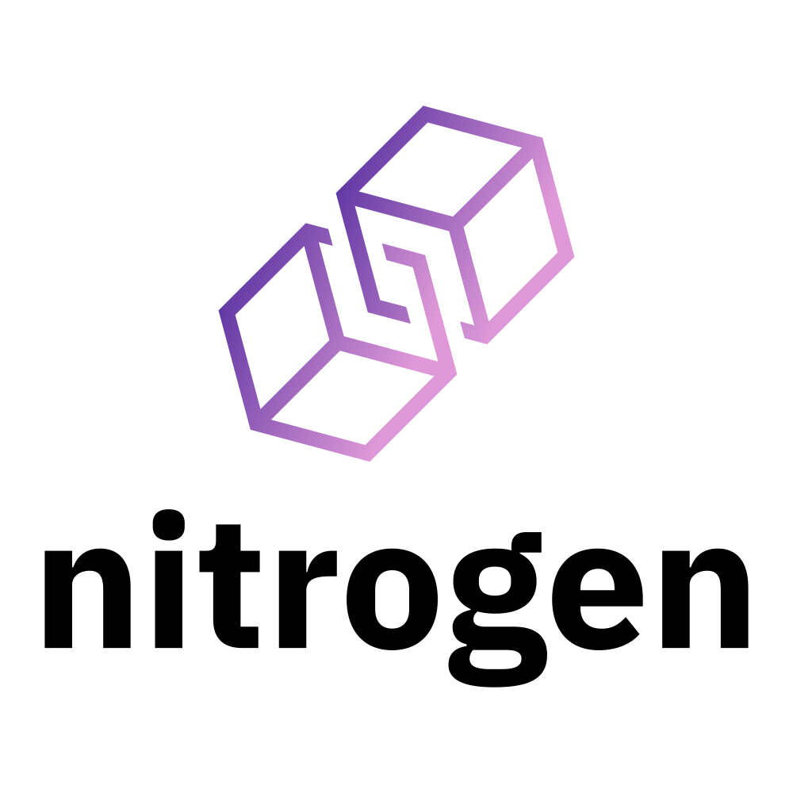

   
  
   
   
  

    Open Source CLI Ethereum Smart Contract event listener and exporter. 
  

  

    version 1.0.0
  

   
  

    <a href="#status"><strong>Status</strong></a> ·
    <a href="#description"><strong>Description</strong></a> ·
    <a href="#install"><strong>Install</strong></a> ·
    <a href="#usage"><strong>Usage</strong></a> ·
    <a href="#contributing"><strong>Contributing</strong></a>
  

---

## Status

**Nitrogen** is currently in **beta** version.

---

## Description

**Nitrogen** is an Open Source CLI Ethereum Smart Contract event listener and exporter made with NodeJS.

---

## Install

Work in progress.

---

## Usage

Work in progress.

---

## Contributing

We welcome community contributions!

Please check out our <a href="https://github.com/CIDARO/nitrogen/issues">open issues</a> to get started.

If you discover something that could potentially impact security, please notify us immediately by sending an e-mail at <a href="mailto:support@cidaro.com">support@cidaro.com</a>. We'll get in touch with you as fast as we can!
